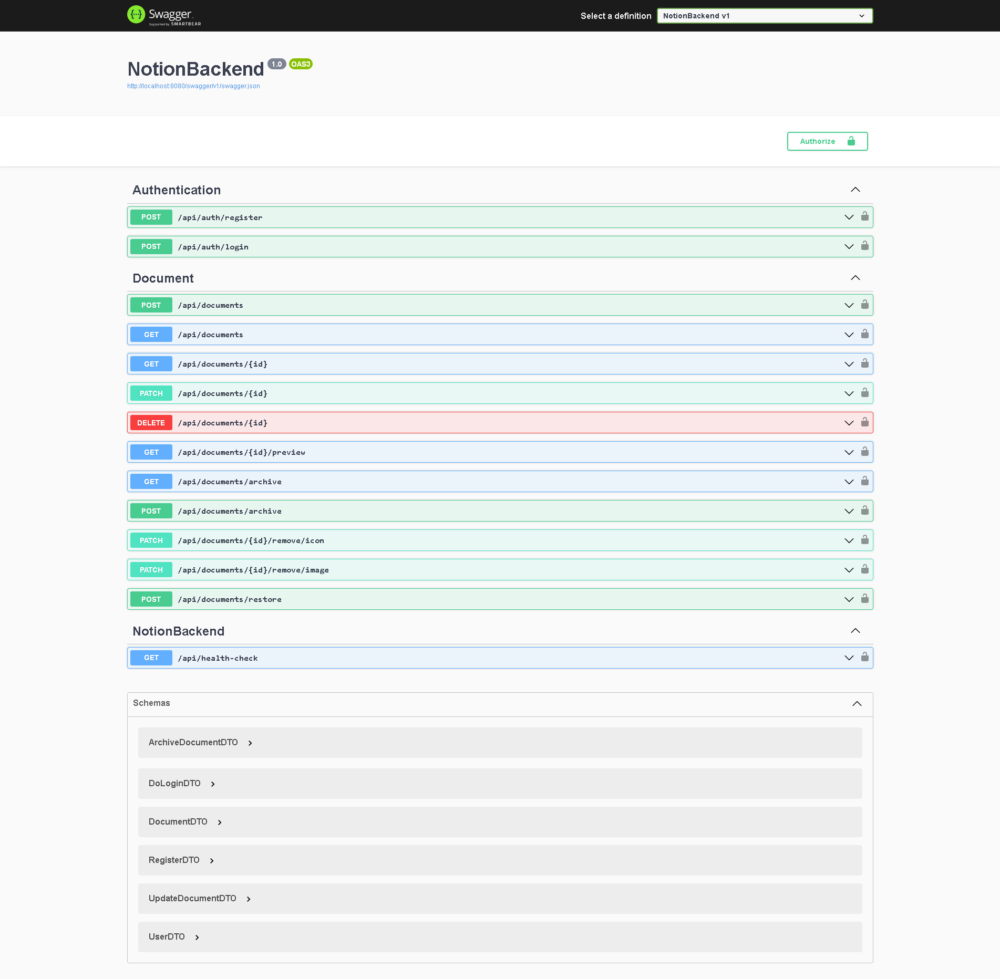

# Application - Notion

Check the [frontend here](https://github.com/matheusjustino/notion-frontend)!

## Resume

    This is an backend application for Notion clone app.

## Information

**In this project were used:** **`C# .NET 7.0 and Entity Framework`**
**as main tools and technologies.**

## Application Screenshots

